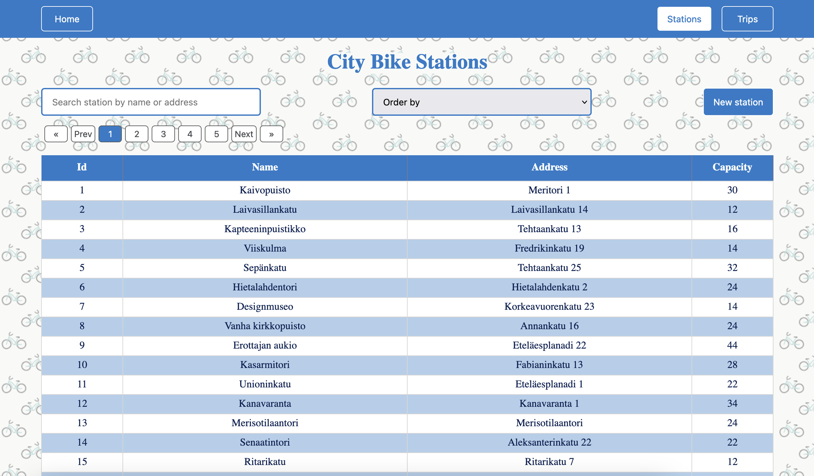
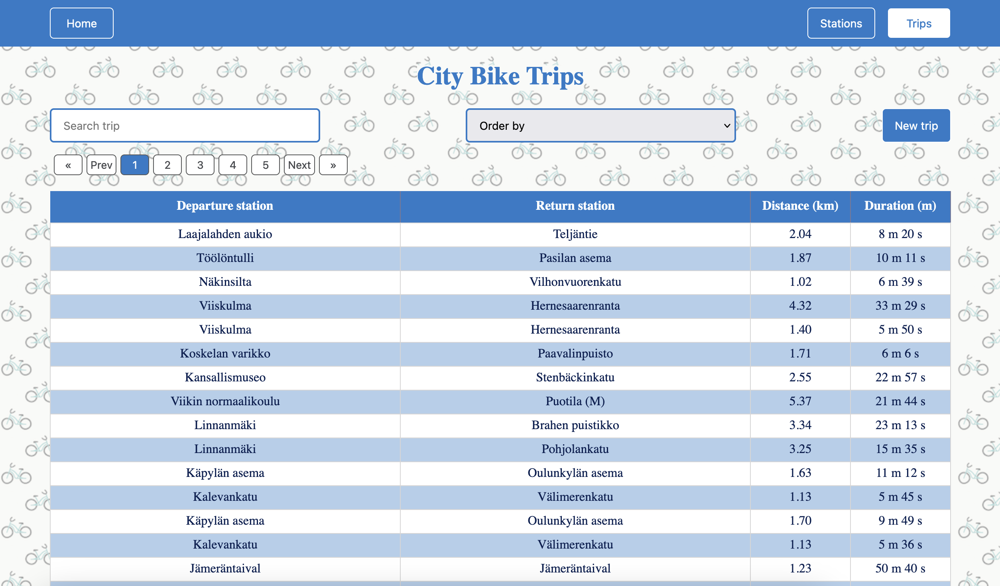
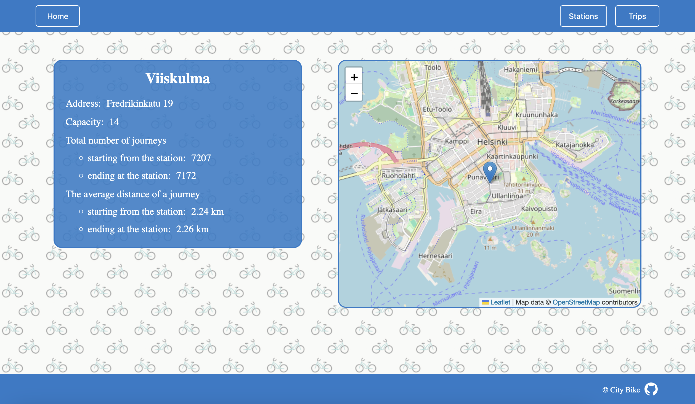
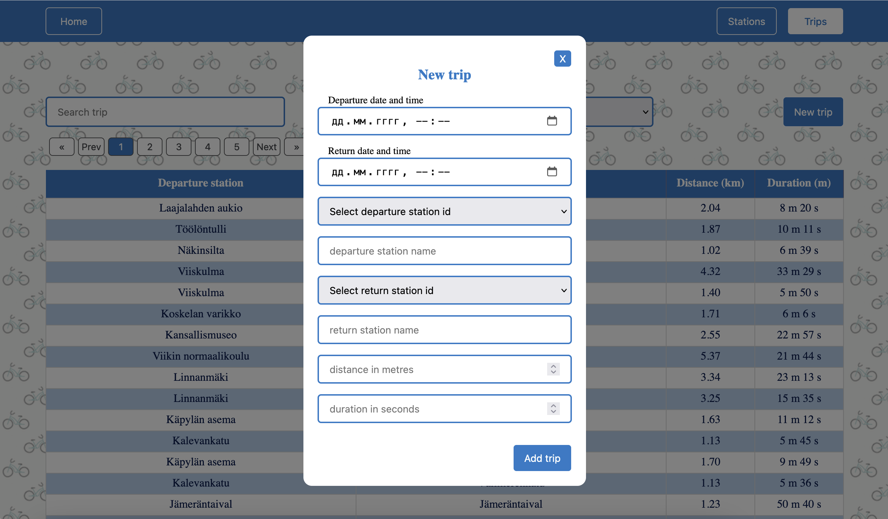
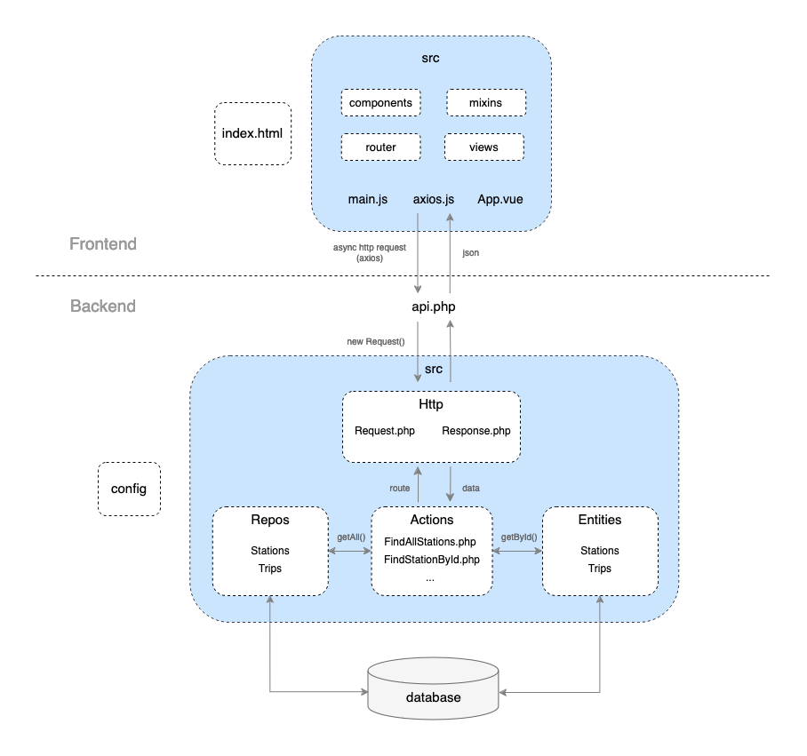

# City Bike

[](https://vuejs.org/)
[](https://www.php.net/)
[](https://getcomposer.org/)
[](https://nodejs.org/)
[](https://www.mysql.com/)

City Bike is a full-stack web application for exploring and managing public bike station data in Helsinki. It allows users to view, search, and analyze station and trip information using an interactive interface and map visualization. Built with Vue.js, PHP, and MySQL.

<p align="center">
  <a href="https://citybike.space">
    
  </a>
</p>

<p align="center">
  <a href="https://citybike.space">Live Demo</a> ·
  <a href="#features">Features</a> ·
  <a href="#screenshots">Screenshots</a> ·
  <a href="#architecture">Architecture</a> ·
  <a href="#technologies-used">Tech Stack</a> ·
  <a href="#getting-started">Install</a>
</p>

## Features

- Preloaded MySQL dump
- List, search, sort and paginate stations and trips
- Detailed station statistics
- Add new stations and trips
- Map view with Leaflet

## Screenshots

### Station List View



### Trip List View



### Single Station View



### New Trip Creation



## Architecture

The diagram below illustrates the overall structure of the application, including interactions between the frontend, backend, and database.



## Technologies Used

- **Vue.js 3** – Frontend framework
- **Leaflet** – Interactive map
- **Axios** – HTTP client
- **PHP 8.x** – Backend logic
- **MySQL 8.x** – Database
- **Composer** – PHP dependency manager

## Getting Started

### 1. Prerequisites

Make sure the following tools are installed:

- PHP 8.x
- Composer
- Node.js + npm
- MySQL

### 2. Clone the Repository

```bash
git clone <repository-url>
cd city-bike
```

### 3. Setup the Database

1. Extract the dataset:

   ```bash
   cd data
   unzip citybike.zip
   ```

2. Create a new MySQL database named `citybike` (recommended encoding: `utf8mb4`):

   ```bash
   mysql -u your_username -p
   ```

   Inside the MySQL prompt:

   ```sql
   CREATE DATABASE citybike CHARACTER SET utf8mb4 COLLATE utf8mb4_unicode_ci;
   exit;
   ```

3. Import the SQL dump:

   ```bash
   mysql -u your_username -p citybike < data/citybike.sql
   ```

### 4. Install Backend Dependencies

```bash
cd ../backend
composer install
```

### 5. Install Frontend Dependencies

```bash
cd ../frontend
npm install
```

### 6. Start the Application

Use two terminal windows:

- Frontend (Vite):

  ```bash
  cd frontend
  npm run dev
  ```

- Backend (PHP):

  ```bash
  php -S localhost:8080 frontend/public/api.php
  ```

App available at [http://localhost:5173](http://localhost:5173)

## Acknowledgments

Data provided by City Bike Finland and HSL:  
[https://www.avoindata.fi/data/en/dataset/hsl-n-kaupunkipyoraasemat/resource/a23eef3a-cc40-4608-8aa2-c730d17e8902](https://www.avoindata.fi/data/en/dataset/hsl-n-kaupunkipyoraasemat/resource/a23eef3a-cc40-4608-8aa2-c730d17e8902)
