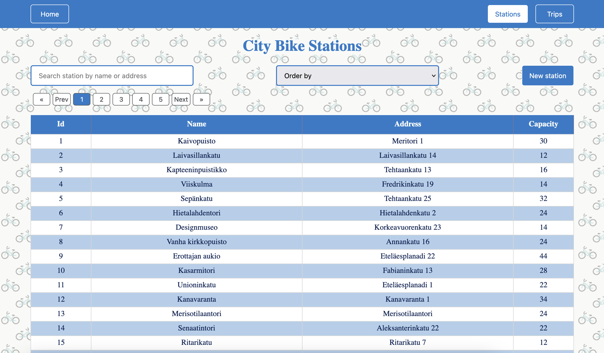
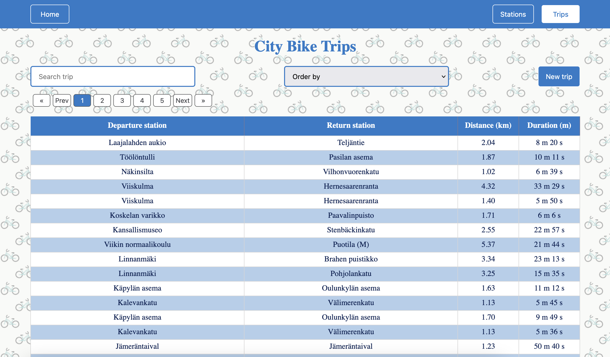
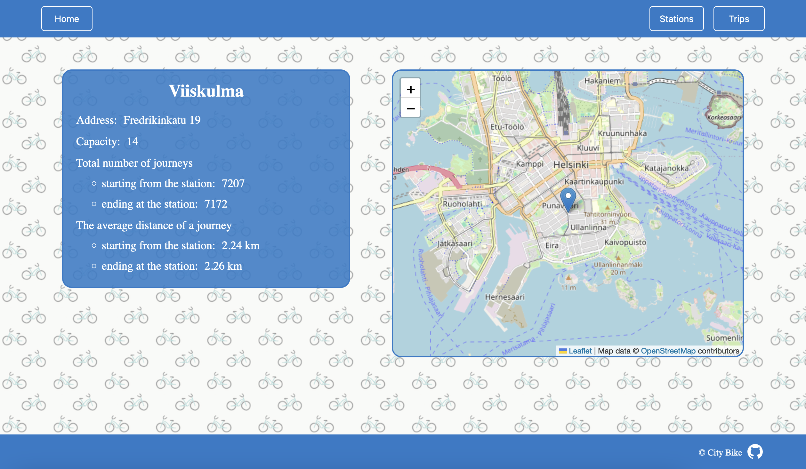
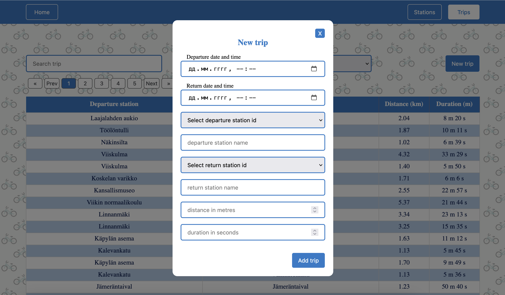

# City Bike

[](https://www.php.net/)
[](https://getcomposer.org/)
[](https://nodejs.org/)
[](https://www.mysql.com/)

This project was created as a pre-assignment for the [Solita Dev Academy](https://github.com/solita/dev-academy-2022-fall-exercise).

This web application displays information about bicycle stations and journeys made with city bikes in the Helsinki Capital area. The frontend was created with Vue.js and the backend with PHP and MySQL.

#

<p align="center">
  <a href="https://citybike.space">
    
  </a>
</p>

<p align="center">
    <a href="#prerequisites">Prerequisites</a>
    ·
    <a href="#backend-setup-without-docker">Backend</a>
    ·
    <a href="#running-the-frontend">Frontend</a>
    ·
    <a href="#data-import">Data import</a>
    ·
    <a href="#features">Features</a>
    ·
    <a href="#screenshots">Screenshots</a>
  </p>

## 🛠️ Setup

### 1. Prerequisites

Make sure the following tools are installed on your system:

- PHP 8.x
- Composer
- Node.js and npm
- MySQL

Check their availability:

```bash
php --version
composer --version
node --version
npm --version
mysql --version
```

Ensure that MySQL server is running. On macOS, you can start it with:

```bash
brew services start mysql
```

Or use another method appropriate for your OS.

### 2. Clone the repository

```bash
git clone <repository-url>
cd city-bike
```

### 3. Setup the database

1. Navigate to the `data` directory and unzip the database:

   ```bash
   cd data
   unzip citybike.zip
   ```

2. Open MySQL CLI:

   ```bash
   mysql -u root -p
   ```

3. Inside MySQL, create the database:

   ```sql
   DROP DATABASE IF EXISTS citybike;
   CREATE DATABASE citybike CHARACTER SET utf8mb4 COLLATE utf8mb4_unicode_ci;
   exit;
   ```

4. Import the SQL dump:

   ```bash
   mysql -u root -p citybike < citybike.sql
   ```

5. (Optional) Verify the import:

   ```bash
   mysql -u root -p
   USE citybike;
   SHOW TABLES;
   SELECT COUNT(*) FROM stations;
   SELECT COUNT(*) FROM trips;
   exit;
   ```

### 4. Install backend dependencies

```bash
cd ../backend
composer install
```

### 5. Install frontend dependencies

```bash
cd ../frontend
npm install
```

### 6. Start the application

In development, run the backend and frontend in two separate terminals:

- Start the **frontend** dev server:

  ```bash
  cd frontend
  npm run dev
  ```

  The app will be available at [http://localhost:5173](http://localhost:5173)

- Start the **PHP backend** server (from the root of the project):

  ```bash
  php -S localhost:8080 frontend/public/api.php
  ```

  This serves as the unified entry point for API requests in local development.

## 🧰 Technologies Used

- [Vue.js 3](https://vuejs.org/) – Frontend framework
- [Leaflet](https://leafletjs.com/) – Interactive map rendering
- [Axios](https://axios-http.com/) – HTTP client for API communication
- [PHP 8.0+](https://www.php.net/) – Backend logic
- [MySQL](https://www.mysql.com/) – Relational database
- [Composer](https://getcomposer.org/) – PHP dependency management

This project combines a Vue.js frontend and a PHP/MySQL backend. The goal was to display and manage city bike journeys and stations in the Helsinki area.

I had prior experience with PHP and MySQL, which helped build the backend efficiently. For the frontend, I used Vue.js to strengthen my modern JavaScript framework skills. Integrating Axios and Leaflet enabled interactive map-based features and smooth API communication.

Through this project, I gained hands-on experience building a full-stack web application with a REST-like API, structured backend logic, and modular frontend components.

## ✨ Features

- Preloaded MySQL database dump for easy setup
- Display list of stations with:
  - Pagination
  - Sorting by columns
  - Search functionality
- Display list of journeys with:
  - Pagination
  - Sorting by columns
  - Search functionality
- Add new city bike stations
- Add new journeys
- View detailed information for a single station:
  - Total number of journeys starting from the station
  - Total number of journeys ending at the station
  - Average distance of journeys starting from the station
  - Average distance of journeys ending at the station
  - Station location displayed on the map (Leaflet)

## Screenshots

### Station List View



### Trip List View



### Single Station View



### New Trip Creation



## Acknowledgments

The data about bicycle stations and journeys is owned by City Bike Finland and HSL. [https://www.avoindata.fi/data/en/dataset/hsl-n-kaupunkipyoraasemat/resource/a23eef3a-cc40-4608-8aa2-c730d17e8902](https://www.avoindata.fi/data/en/dataset/hsl-n-kaupunkipyoraasemat/resource/a23eef3a-cc40-4608-8aa2-c730d17e8902)
